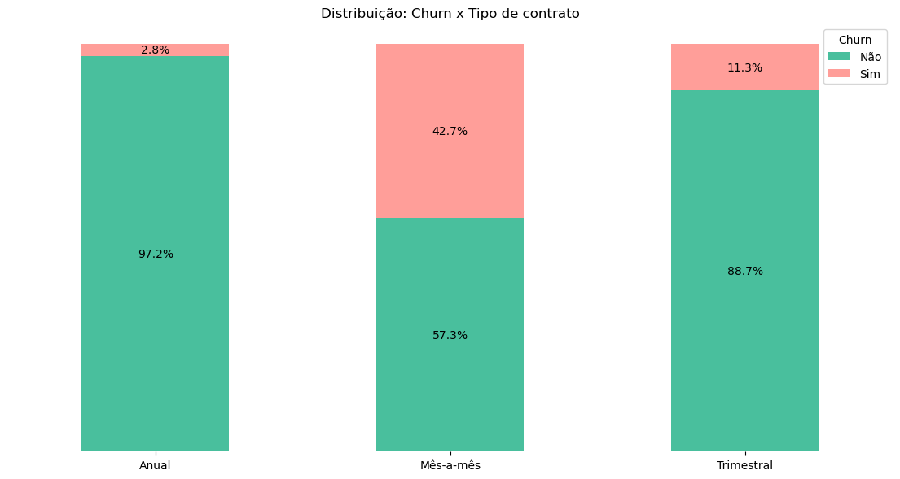
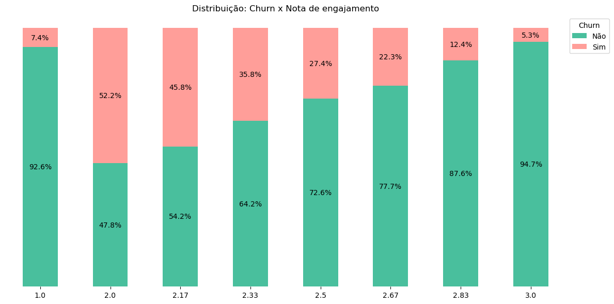
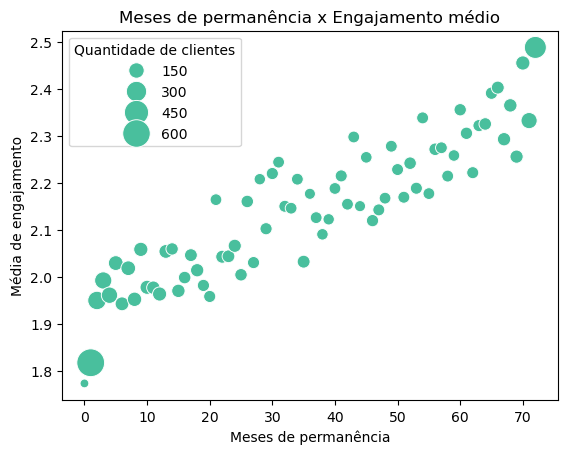
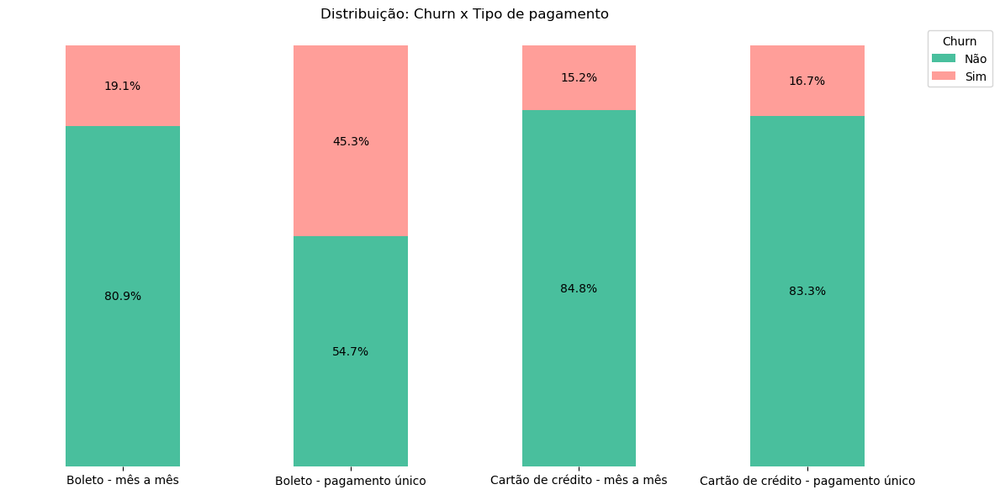
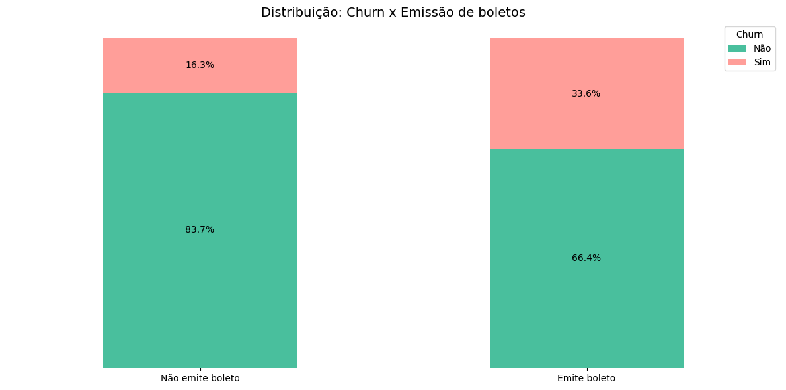
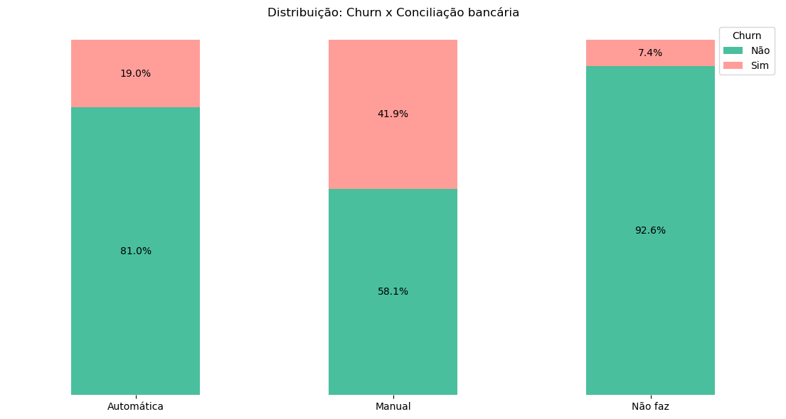
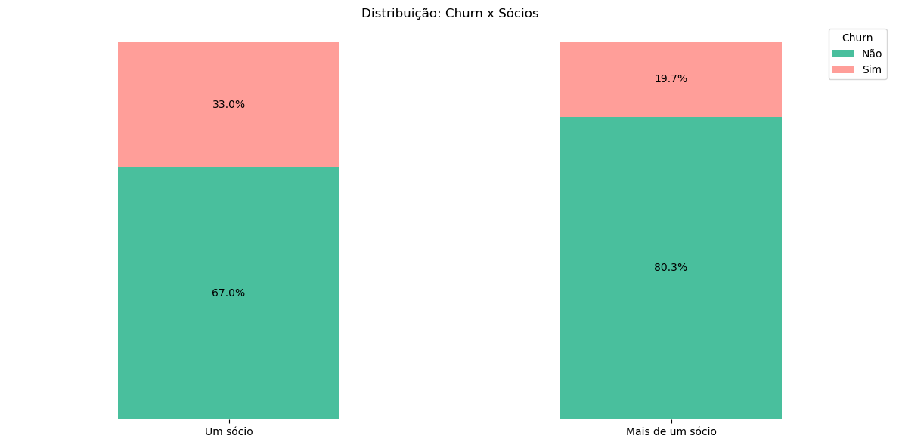
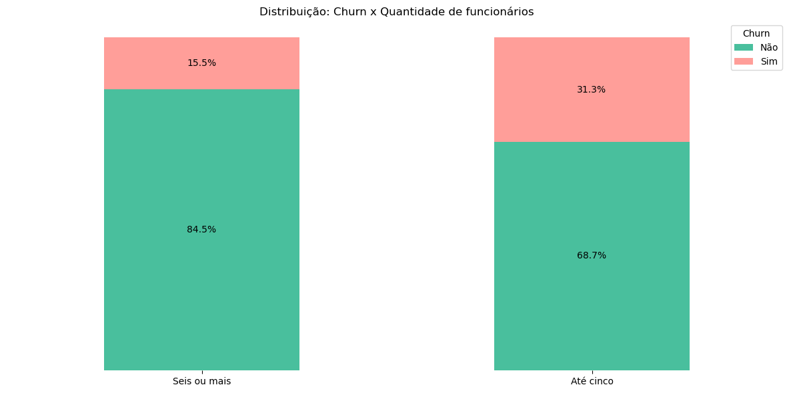

# **Projeto Análise Exploratória de Dados de Churn**

### Resumo

Esse projeto analisou dados de uma empresa que atua no modelo SaaS (Software as a Service) que tem como produto um sistema de ERP (Enterprise Resource Planning) com o objetivo de validar a hipótese de que a taxa de churn da plataforma estaria aumentando. Além disso, realizou-se uma análise exploratória de dados (EDA) para identificar padrões relevantes nos dados que pudessem apoiar a equipe de negócios.

A análise realizada permitiu a identificação de um aumento de 24,6% na taxa mensal de churn de abril/2025 para maio/2025, demonstrando a necessidade de investigar fatores que podem estar relacionados ao aumento do churn no período, como piora recente na experiência do cliente e no suporte, mudanças no produto, aumento de preço e efeitos da concorrência.

Verificou-se, também, que contratos curtos (mês a mês) possuem maior percentual de churn que contratos trimestrais e anuais. Além disso, o engajamento com o sistema se mostrou um fator relevante: a análise do engajamento médio com as funcionalidades do sistema demonstrou uma queda do percentual de churn à medida que o engajamento aumenta.

Os produtos da análise foram uma apresentação de negócios com os principais insights obtidos e um notebook comentado em Python contendo todo o tratamento de dados e a análise realizada.

[Apresentação - Churn](https://www.canva.com/design/DAGy0XAtopw/6b5dBXWuadOPUyQP06Q5ng/view?utm_content=DAGy0XAtopw&utm_campaign=designshare&utm_medium=link2&utm_source=uniquelinks&utlId=hd657d672ae)

Leia mais sobre o projeto abaixo.

### Índice

- [1. Contexto](https://github.com/luisamuzzi/projeto_churn/edit/main/README.md#1-contexto)
- [2. Premissas assumidas para a análise](https://github.com/luisamuzzi/projeto_churn/edit/main/README.md#2--premissas-assumidas-para-a-an%C3%A1lise)
- [3. Ferramentas utilizadas](https://github.com/luisamuzzi/projeto_churn/edit/main/README.md#3-ferramentas-utilizadas)
- [4. Estratégias de solução](https://github.com/luisamuzzi/projeto_churn/edit/main/README.md#4-estrat%C3%A9gias-de-solu%C3%A7%C3%A3o)
- [5. O produto final do projeto](https://github.com/luisamuzzi/projeto_churn/edit/main/README.md#5-o-produto-final-do-projeto)
- [6. Principais insights de dados](https://github.com/luisamuzzi/projeto_churn/edit/main/README.md#6-principais-insights-de-dados)
- [7. Conclusão](https://github.com/luisamuzzi/projeto_churn/edit/main/README.md#7-conclus%C3%A3o)
- [8. Próximos passos](https://github.com/luisamuzzi/projeto_churn/edit/main/README.md#8-pr%C3%B3ximos-passos)

### 1. Contexto

Este projeto analisou dados de clientes de uma empresa que atua no modelo de SaaS que tem como produto um sistema de ERP. Foi realizada uma análise exploratória de dados para validar a hipótese de aumento de churn dos contratos e identificar padrões que pudessem apoiar a equipe de negócios nas ações para reduzir o churn.

Os dados utilizados incluem características das empresas clientes, tempo de permanência em meses, frequência de uso das funcionalidades do sistema, tipo de contrato e pagamento, receita gerada, ocorrência de churn, mês de churn, entre outros.

Utilizou-se Python para tratamento e análise dos dados.

Os principais insights obtidos foram inseridos em uma apresentação de negócios.

### 2.  Premissas assumidas para a análise

1. A análise foi realizada com dados de churn que ocorreram em abril e maio de 2025.
2. Os dados utilizados foram obtidos no EBA: https://renatabiaggi.com/eba-estatistica/
3. A imagem utilizada no portfólio foi retirada de: https://storyset.com/illustration/update/amico

### 3. Ferramentas utilizadas

- Python para a EDA
    - Pandas
    - Seaborn
    - Matplotlib
- Canva para a apresentação

### 4. Estratégias de solução

O projeto foi desenvolvido por meio de uma Análise Exploratória de Dados, considerando-se as seguintes etapas:

1. Exploração univariada:
    
    Nesta etapa, os dados foram explorados a fim de entender os tipos de variável, investigar valores únicos, verificar valores ausentes ou nulos, investigar possíveis padrões na ocorrência de valores nulos, verificar a qualidade dos dados (por exemplo: escrita inconsistente, zeros onde não deveriam existir, unidades inconsistentes) e analisar a distribuição de variáveis categóricas e numéricas.
    
2. Exploração multivariada:
    
    Nesta etapa realizou-se uma análise temporal para validar a hipótese de aumento do churn. Além disso, foram realizados agrupamentos para analisar a variável alvo (ocorrência de churn) juntamente com as outras variáveis disponíveis, o que permitiu a detecção de padrões que pudessem estar associados ao churn.
    

### 5. O produto final do projeto

1. Apresentação de negócios com os principais insights sobre as características gerais dos clientes, validação da hipótese de aumento do churn e características dos clientes associadas ao churn. Além disso, foram dadas recomendações para lidar com o churn baseadas em tais características dos clientes. 
    
    O relatório pode ser visualizado por meio do link:
    
    [Apresentação - Churn](https://www.canva.com/design/DAGy0XAtopw/6b5dBXWuadOPUyQP06Q5ng/view?utm_content=DAGy0XAtopw&utm_campaign=designshare&utm_medium=link2&utm_source=uniquelinks&utlId=hd657d672ae).
    
2. Notebook contendo a análise completa dos dados.

### 6. Principais insights de dados

**Perfil geral dos clientes:**

- Cerca de 70% das empresas que utilizam ou utilizaram nosso software têm até 5 funcionários.
- Cerca de 44% das empresas que utilizam ou utilizaram nosso software fazem conciliação bancária manual e cerca de um quarto não faz conciliação bancária, o que indica um **menor nível de maturidade operacional e automação**.
- Cerca de 22% nunca fizeram uso de nenhuma funcionalidade do sistema, o que pode indicar um grupo de clientes inativos ou que só faz **uso básico do sistema**. No outro extremo, cerca de 4% fizeram uso frequente de todas as funcionalidades.
- Cerca de 55% dos nossos **contratos são mensais**.
- Cerca de 75% das empresas clientes foram fundadas a partir de 2016, indicando um perfil de clientes constituído em maior parte por **empresas mais jovens** (com menos de 10 anos).
- A **mediana de permanência das empresas clientes é de 29 meses** (2 anos e 5 meses), o que significa que metade delas têm contrato há menos de 29 meses e a outra metade há mais de 29 meses. A permanência mínima registrada foi de 0 meses e a máxima de 72 meses (6 anos).

**Análise do churn – Comparação entre abril/2025 e maio/2025:**

- Dos churns registrados na base de dados (1869), 49% (911) ocorreram em abril/2025 e 51% (958) em maio/2025. Ou seja, **a quantidade de churns aumentou em 5,16%** em 05/2025 em relação a 04/2025 (47 churns a mais).
- A taxa geral de churn é de 36%. Em abril/2025, a taxa de churn foi de 15%, tendo aumentado para 19% em maio/2025. Ou seja, **houve um aumento de cerca de 24,6% na taxa mensal de churn de abril/2025 para maio/2025**. Entretanto, como a base de dados contém apenas esses dois meses, não se pode afirmar que esse aumento representa uma tendência a longo prazo.

**Análise do churn – Padrões observados:**

- A quantidade de churns em contratos mês a mês (1655) é significativamente maior que a quantidade de churns em contratos trimestrais (166) e anuais (48). **Cerca de 43% dos contratos mês a mês foram cancelados.** Parece haver indícios de que modalidades mais longas de contrato têm menor chance de churn.
    
    
    
- A análise da nota de engajamento das empresas demonstrou que, no caso dos usuários com nota 1 (nunca utilizaram nenhuma das seis features do sistema), a grande maioria não cancelou (~92,6%). O que pode indicar usuários novos que ainda não tiveram tempo de utilizar o sistema ou usuários que utilizam apenas funcionalidades mais básicas do sistema. A partir da nota de engajamento 2, **o número de churns diminui à medida que o engajamento aumenta**, havendo apenas 5,28% de churns dentre as empresas com engajamento máximo.
    
    
    
- Ao analisar o engajamento médio por tempo de permanência, observa-se que há uma **correlação positiva entre o engajamento e o número de meses de permanência**.
    
    
    
- A mediana de permanência dos churns é de 10 meses, enquanto a dos não-churns é de 38 meses. **Metade das empresas que cancelaram o fizeram antes de completar um ano**. Isso pode indicar que campanhas para aumentar o tempo de permanência de usuários aumentem a chance de fidelização.
- A quantidade de churns que ocorreram em empresas que realizavam pagamento único por boleto é maior que os churns das outras modalidades de pagamento. **45% das empresas que realizam o pagamento por boleto único cancelaram**, enquanto para outras modalidades, o churn variou entre aproximadamente 15 e 20%.
    
    
    
- A proporção de churn é maior nas empresas que emitem boleto.
    
    
    
- A proporção de churn é maior entre as empresas que fazem conciliação bancária manual. As que não fazem conciliação bancária possuem menor percentual de churn.
    
    
    
- A proporção de churns é maior nas empresas que possuem apenas um sócio.
    
    
    
- A proporção de churn é maior dentre as empresas com até 5 funcionários.
    
    
    
- No caso das frequências de uso do módulo financeiro, integração bancária, módulo de vendas e emissão de nota fiscal, a proporção de churns entre as empresas que fazem pouco uso de alguma funcionalidade é maior do que os churns de empresas que nunca usaram ou que usam frequentemente. No caso do uso de relatórios e do uso de APIs de integração, a proporção de "pouco uso" e "uso frequente" é semelhante entre as empresas que cancelaram.
- A receita mensal mediana gerada pelo grupo de churns foi de R$ 79,65, enquanto a do grupo de não-churns foi de R$ 64,43. Em geral, **os clientes que saíram têm um ticket médio maior que os que ficaram**. Já a receita total mediana gerada pelos churns foi de R$ 703,55, enquanto a do grupo de não-churns foi de R$ 1.683,60. Isso indica que **os clientes retidos deixaram mais dinheiro na empresa e que o grupo de churns é o de menor valor histórico**.

### 7. Conclusão

A análise dos dados permitiu a obtenção de insights importantes sobre o perfil geral de clientes da empresa e, em especial, sobre o **churn** e os **padrões relacionados à sua ocorrência**.

**Quem é o nosso cliente:**

Em sua maioria, nossos clientes são empresas jovens (fundadas há menos de 10 anos) e com até 5 funcionários. A maioria faz conciliação bancária manual ou não faz, indicando menor maturidade operacional e menor uso de automação. A mediana de permanência das empresas clientes é de 2 anos e 5 meses.

**Aumento do churn:**

- A taxa geral de churn é de 36%.
- Em abril ocorreram 911 churns, já em maio este número aumentou para 958, representando um **aumento de 5,16% na quantidade de usuários que cancelaram**.
- Já em termos da taxa mensal de churn (cancelamentos/usuários ativos), observou-se uma taxa mensal de 15% em abril e 19% em maio, ou seja, um **aumento de 24,6% na taxa mensal de churn**.

Destaca-se que ainda não é possível concluir se esse aumento representa uma tendência a longo prazo, pois só foram analisados dois meses de dados.

**Padrões observados em relação ao churn:**

- **Baixo tempo de permanência:** Metade dos churns ocorreram antes do cliente completar um ano de contrato.
- **Influência do tipo de contrato na retenção:** Contratos de curto prazo (mês a mês) possuem maior percentual de churn do que contratos anuais ou trimestrais.
- **Influência da forma de pagamento na retenção:** Contratos com pagamento único por boleto possuem maior percentual de churn do que contratos com outras modalidades de pagamento.
- **Importância do engajamento:** A análise do engajamento médio com as funcionalidades do sistema demonstrou uma queda do percentual de churn à medida que o engajamento aumenta. Além disso, observou-se uma correlação positiva entre o engajamento e o tempo de permanência.
- **Outros fatores de influência:** características como quantidade de sócios e funcionários, emissão de boleto e consolidação bancária impactam o churn, porém em menor escala.

**Recomendações:**

- É importante investigar fatores que podem estar relacionados ao aumento do churn no período, como piora recente na experiência do cliente e no suporte, mudanças no produto, aumento de preço e efeitos da concorrência.
- Incentivo à migração para contratos mais longos.
- Incentivar ações para aumento do engajamento de clientes pouco ativos.
- Monitoramento contínuo da taxa de churn e dos fatores associados aos cancelamentos.

### 8. Próximos passos

Investigação das variáveis de receita, com cruzamento de dados de receita total x tempo de permanência, receita mensal x tempo de permanência e receita mensal x receita total. 

As correlações entre essas variáveis podem ajudar a entender a relação entre o tempo de permanência e a receita total acumulada, a influência da receita mensal (valor mensal do plano de assinatura) no tempo de permanência do cliente e a influência do ticket médio na receita total acumulada.
